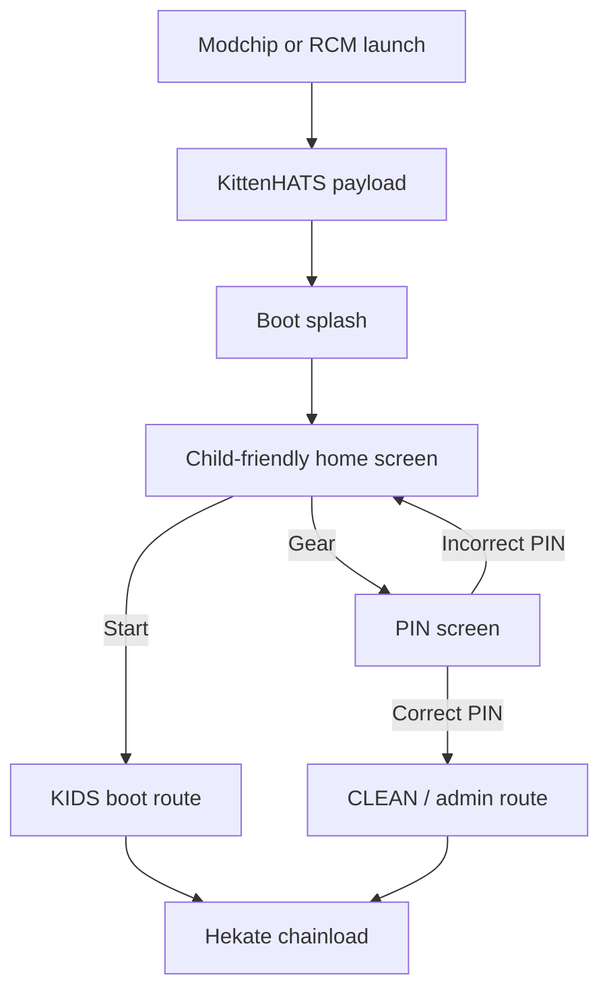

<div align="center">

# KittenHATS 🐱🎮

**A child-friendly boot interface for modified Nintendo Switch systems.**

*One-button KIDS boot routing, PIN-gated administration and a compact bare-metal C payload.*

</div>

<p align="center">
  <a href="#-features"><b>Features</b></a> •
  <a href="#-how-it-works"><b>How It Works</b></a> •
  <a href="#-prerequisites"><b>Prerequisites</b></a> •
  <a href="#-quick-start"><b>Quick Start</b></a> •
  <a href="#-building-from-source"><b>Build</b></a> •
  <a href="#-project-status"><b>Status</b></a>
</p>

<p align="center">
  
  
  
  
  
</p>

<br>

<p align="center">
  <a href="https://www.buymeacoffee.com/lynoa">
    
  </a>
</p>

## 🐱 What is KittenHATS?

A modified Nintendo Switch can expose complex bootloader and maintenance options that are unsuitable for normal child use.

**KittenHATS adds a simpler entry point.**

It starts as a standalone bare-metal payload before the normal firmware. The regular KIDS route presents one large button that starts the configured emuMMC boot entry. Administrative boot access remains available through a PIN-gated route.

> **KittenHATS is not a complete HATS distribution.**
> It does not create emuMMC, install Atmosphère, configure Hekate automatically or restrict applications after Atmosphère has started.

KittenHATS does not require a source-code fork of Hekate. It is installed alongside an existing Hekate/HATS setup, although installation adds and replaces selected files on the SD card. Hekate can remain an upstream submodule, but KittenHATS may need to be reapplied after a HATS update.

---

## 🎬 Demo

<p align="center">
  
</p>

The demo shows the KittenHATS startup flow, child-friendly interface, PIN-gated administration and KIDS/CLEAN boot routing.

---

## ✨ Features

| Feature | Description | Status |
|---|---|---|
| **Child-friendly home screen** | One-button route to the configured KIDS emuMMC entry | Implemented |
| **PIN-gated administration** | Administrative boot access remains behind a PIN | Implemented |
| **KIDS / CLEAN routing** | Separate normal-use and maintenance boot paths | Implemented |
| **Language selection** | Dutch, English, German, French and Spanish interface text | Implemented |
| **Splash screen** | Branded boot splash before the main interface | Implemented |
| **Reboot-to-payload integration** | Supported reboot-to-payload actions can return to KittenHATS | Implemented |
| **Theme switching** | Runtime-selectable visual themes | Planned; not implemented |

---

## 🔧 How It Works

```
Power On → Modchip/RCM → KittenHATS (payload.bin)
                              │
                    ┌─────────┴──────────┐
                    ▼                    ▼
              [Start Button]       [Gear Icon]
                    │                    │
                    ▼                    ▼
           Boot from ID "KIDS"     PIN-pad (4 digits)
                    │                    │
                    ▼              ┌─────┴──────┐
              emuMMC (safe)       ▼              ▼
                            Correct PIN    Wrong PIN
                                  │              │
                                  ▼              ▼
                            Nyx/HATS menu   Back to home
```

### What this solves

1. **At boot** — the child never sees the Nyx/Hekate menu, only the big Start button.
2. **In firmware** — KittenHATS limits access to the bootloader interface during startup. It does not by itself restrict applications, homebrew entry points or overlays after Atmosphère has started.

---

## ✅ Prerequisites

> [!IMPORTANT]
> Create and verify emuMMC **before** installing KittenHATS.
>
> KittenHATS does not create emuMMC, install Atmosphère or configure a complete Hekate/HATS environment.

You will need:

- A compatible modified Nintendo Switch capable of launching Hekate-based payloads.
- [HATS](https://github.com/sthetix/HATS) distribution installed on a FAT32 SD card.
- A working emuMMC that has been boot-tested directly in Hekate.
- An SD card reader for your computer.

### Required Installation Order

```text
Prepare Hekate/HATS
        ↓
Create emuMMC
        ↓
Boot-test emuMMC in Hekate
        ↓
Back up the SD card
        ↓
Install KittenHATS
        ↓
Configure KIDS routing
        ↓
Change PIN 1234
        ↓
Test KIDS and admin routes
```

---

## 🚀 Quick Start

A public overlay release will be added after the remaining validation work is complete.

For now, the payload can be built from source (see [Building from Source](#-building-from-source)).

### Manual Installation

1. **Build** the payload from source, or obtain a pre-built `kittenhats.bin`.
2. **Copy** `kittenhats.bin` to the SD card root as `payload.bin`.
3. **Copy** `kittenhats.bin` to `bootloader/kittenhats/kittenhats.bin`.
4. **Merge** the overlay contents into the SD card root. Do not delete or replace the entire existing `bootloader` directory.
5. **Close the reboot backdoor:** Replace `atmosphere/reboot_payload.bin` with `kittenhats.bin`.
6. **Configure** `kittenhats.ini` on your SD card (see [Configuration](#configuration)).
7. **Boot** your Switch — you should see the KittenHATS home screen.

> [!CAUTION]
> Review file conflicts before overwriting anything and keep a complete SD card backup.

### File Placement

```
SD Card Root:
├── payload.bin              ← KittenHATS payload (copied from build)
├── kittenhats.ini           ← PIN hash and paths (create this)
├── bootloader/
│   └── kittenhats/
│       ├── kittenhats.bin   ← KittenHATS payload (second copy)
│       ├── splash.bin       ← Splash image
│       └── assets/
│           ├── common/      ← Shared UI assets
│           └── themes/      ← Theme assets (planned)
├── atmosphere/
│   └── reboot_payload.bin   ← Replace with kittenhats.bin
└── (rest of HATS distribution)
```

---

## 🔐 Default Administrator PIN

The default administrator PIN is:

```text
1234
```

The PIN is intended as a child-proofing barrier. It is not cryptographic security, and physical SD card access may allow the configuration to be changed.

---

## Configuration

### `kittenhats.ini`

Create this file at `bootloader/kittenhats/kittenhats.ini` on your SD card to configure the PIN gate. Use the example configuration provided with the release package.

```ini
[security]
pin_gate_enabled  = 1
pin_scheme        = sha256-salt-v1
pin_length        = 4
pin_salt_hex      = a1b2c3d4e5f6a7b8c9d0e1f2a3b4c5d6
pin_hash_hex      = 03ac674216f3e15c761ee1a5e255f067953623c8b388b4459e13f978d7c846f4
```

| Key | Description | Expected Value |
|-----|-------------|----------------|
| `pin_gate_enabled` | Enable PIN gate | `1` |
| `pin_scheme` | Hash scheme identifier | `sha256-salt-v1` |
| `pin_length` | PIN length (digits) | `4` |
| `pin_salt_hex` | 16-byte salt as 32 hex characters | Random per device |
| `pin_hash_hex` | SHA-256(salt \|\| PIN) as 64 hex characters | Hash of your PIN |

The example hash above corresponds to PIN `1234` with the example salt. Replace both `pin_salt_hex` and `pin_hash_hex` with values generated for your own PIN.

> [!IMPORTANT]
> The PIN is hashed as `SHA-256(salt[16] || pin_ascii[4])` using the Tegra X1 Security Engine. Use the `kittenhats-tools` package to generate a valid configuration for your PIN.
>
> The config file must be placed at `bootloader/kittenhats/kittenhats.ini` — not the SD card root.

---

## 🛠 Building from Source

### Prerequisites

- [devkitPro](https://devkitpro.org/) with devkitARM.
- Python 3.x.
- Git.

### Setup

```bash
# Clone the repository
git clone https://github.com/Farmeobaasje/KittenHATS.git
cd KittenHATS

# Initialise submodule (Hekate source)
git submodule update --init

# Navigate to app directory
cd app
```

### Build

```bash
# Using devkitPro msys2 shell (Windows)
export DEVKITPRO=e:/devkitPro
export DEVKITARM=e:/devkitPro/devkitARM
make clean && make
```

**Expected output:**

- `app/dist/kittenhats.bin` — the built payload (< 256 KB).
- `app/dist/splash.bin` — splash image (3.6 MB).

### Build Requirements

| Tool | Version | Notes |
|------|---------|-------|
| devkitARM | Latest | Install via devkitPro pacman: `pacman -S devkitARM` |
| Python 3 | 3.x | For splash image conversion |
| Hekate submodule | `v6.4.2-28-ge779e4c` (commit `e779e4c`) | Automatically fetched via `git submodule update --init` |

---

## 📊 Project Status

| Area | Status |
|------|--------|
| Splash and interface | Implemented |
| KIDS route | Implemented |
| CLEAN/admin route | Implemented |
| PIN gate | Implemented |
| Languages | Implemented |
| Reboot-to-payload integration | Implemented |
| Theme switching | Planned; not implemented |
| Demo video | Coming soon |

**Version:** v0.1.24 — pre-release.

**Payload size:** 127,625 bytes

**SHA-256:** `566a31b6d11a7147822a2f2b378024eb4d0e44fe21b66a18cf5ab192581b8a1d`

### Current Limitations

- **Theme support** is planned but is not implemented in the current public build. Theme assets are present in the repository for future use, but runtime theme switching is not yet functional.
- **Demo video** is being prepared and is not yet available.
- **Logo/branding** is being prepared and is not yet approved.
- **PIN security** is child-proofing only. Physical SD card access bypasses it.

---

## 🏗 Architecture



### Architecture Principles

| Principle | Description |
|-----------|-------------|
| **Standalone payload** | KittenHATS runs before the normal firmware |
| **No Hekate source fork** | Hekate remains a tracked upstream submodule |
| **Fail-safe routing** | Incorrect PIN input never grants administrative access |
| **Constrained runtime** | The payload is designed for the early-boot memory environment |
| **Reproducible dependency** | The exact Hekate submodule revision is tracked |

### Boot Flow

1. The configured modchip or RCM launch method starts the KittenHATS payload.
2. KittenHATS initialises hardware (display, touch, SD, timer) via the BDK.
3. The LVGL GUI renders the home screen.
4. On button press, KittenHATS writes the appropriate boot storage flag (KIDS or CLEAN).
5. KittenHATS chainloads the Hekate binary (`update.bin`).
6. Hekate reads the boot storage flag and boots the corresponding target.

### Directory Structure

```
app/
├── src/
│   ├── main.c              # Entry point: hardware init → UI → chainload
│   ├── ui/
│   │   ├── screen_home.c   # Child-friendly home screen
│   │   ├── screen_pin.c    # PIN pad with verification
│   │   ├── screen_lang.c   # Language selection screen
│   │   └── screen_settings.c # Settings screen
│   ├── boot/
│   │   ├── chainload.c     # Hekate binary loading and launch
│   │   └── bootcfg.c       # Boot storage flags (KIDS / CLEAN)
│   └── config/
│       ├── kh_config.c     # Config file parsing (kittenhats.ini)
│       ├── kh_pin_verify.c # PIN hash verification
│       └── kh_ui_config.c  # UI configuration management
├── vendor/hekate/          # Hekate source (submodule, unmodified)
├── res/                    # Build-input BMP assets
└── dist/                   # Build output
```

---

## 💡 Technical Highlights

- **Bare-metal C** — no operating system, no sandbox. Everything runs directly on the Tegra X1.
- **LVGL** — embedded GUI toolkit, the same version used by Nyx.
- **Hekate BDK** — hardware drivers for display, touch, SD card and timers.
- **Boot storage mechanism** — uses Hekate's native boot-from-ID system to select the boot target without modifying Hekate itself.
- **SHA-256 PIN verification** — the PIN is not stored as plain text.
- **Submodule-based vendor code** — the tracked Hekate submodule is kept unmodified in this repository. Upstream updates can be pulled without conflicts.
- **Payload size** — the payload is kept compact to fit within the constrained early-boot memory layout.

---

## 🧱 Why I Built KittenHATS

I come from a construction background rather than a traditional software-engineering path. KittenHATS began as a practical family problem: simplifying a complex modified-console boot process so that a child could use the normal route without being presented with maintenance tools.

The project grew into a serious embedded C learning exercise involving bare-metal execution, LVGL, Hekate internals, build systems, framebuffer debugging, input handling and hardware validation.

KittenHATS is part of my professional portfolio and demonstrates how I approach unfamiliar technical problems: break them down, research the underlying systems, test assumptions and keep iterating until the result works on real hardware.

---

## 🤖 How AI Was Used

| Tool | Role |
|---|---|
| **Bestek** | Structured the initial project definition, architecture, roadmap and agent context |
| **ChatGPT** | Research, implementation proposals, debugging and documentation review |
| **DeepSeek API** | Additional code analysis and technical review |

AI accelerated research and implementation, but critical behaviour was checked through source inspection, clean builds, binary hashes and iterative on-device testing.

---

## ⚠️ Safety and Disclaimer

> [!WARNING]
> Modifying your Nintendo Switch involves risk. KittenHATS provides access to system-level tools that can damage your console if used incorrectly.

- This software is intended **only for compatible modified systems**.
- Use **at your own risk**. The authors are not responsible for any damage to your device.
- **Make backups** before installing or modifying your system configuration.
- Incorrect installation may cause boot problems or data loss.
- The PIN is **child-proofing, not cryptographic security**. Anyone with physical access to the SD card can bypass it.
- No firmware, keys, dumps or proprietary Nintendo data are included in this repository.
- This is an **independent project** and is not affiliated with Nintendo, CTCaer, Hekate or HATS.

---

## 💬 Support

- 🐛 Open a [GitHub Issue](https://github.com/Farmeobaasje/KittenHATS/issues)
- 🔧 Read [CONTRIBUTING.md](./CONTRIBUTING.md)
- 🔒 Read [SECURITY.md](./SECURITY.md)
- ⭐ Star the repository if the project is useful to you

---

## 📄 License and Attribution

### License

KittenHATS is licensed under the **GNU General Public License v2.0** (GPL-2.0). See [LICENSE](./LICENSE) for the full text.

### Third-Party Components

| Component | Role | License |
|-----------|------|---------|
| **Hekate / Hekate BDK** | Hardware and platform support | See upstream and `THIRD_PARTY_LICENSES.md` |
| **LVGL** | Embedded UI library | See bundled/upstream notice |
| **FatFs** | Filesystem library | See bundled/upstream notice |
| **devkitARM** | Build toolchain | Toolchain; not linked as a runtime component under a single project license |

The tracked Hekate submodule is kept unmodified in this repository.

See [THIRD_PARTY_LICENSES.md](./THIRD_PARTY_LICENSES.md) for full third-party license details.

---

## 🙏 Acknowledgments

- **CTCaer** — for Hekate, the bootloader that makes projects like this possible.
- **sthetix** — for HATS, the distribution that KittenHATS builds on.
- **devkitPro** — for the ARM toolchain and homebrew ecosystem.
- **LVGL** — for the embedded GUI framework.
- The **Nintendo Switch homebrew community** — for documentation, tools and shared knowledge.

---

<p align="center">
  <sub>
    Built with persistence, open-source tools and AI-assisted development by
    <a href="https://github.com/Farmeobaasje">Farmeobaasje</a>.
  </sub>
</p>
